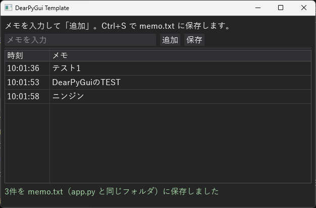

# DearPyGui 2.x テンプレート

ニンジン🥕（[py-vbalab.com](https://py-vbalab.com)）の記事で配布している、DearPyGui 2.x 用の最小テンプレートです。
日本語フォント・横並びレイアウト・テーブル・Ctrl+S ショートカット・エラー表示まで入っています。



## 中身

| ファイル | 役割 |
|---|---|
| `app.py` | テンプレート本体。ここを書き換えて使う |
| `AI_RULES.md` | AIにコードを書かせるときに一緒に渡すルール |
| `examples/` | 部品ごとの見本（文字・ボタン・入力・選択・配置・まとめる）。1ファイルずつ単体で動く |
| `check_old_api.py` | AIが書いたコードに 1.x 以前の書き方や、Windowsで落ちる書き方が混ざっていないか調べる |

## 使い方

```bash
pip install -r requirements.txt
python app.py
```

AIに機能を追加させるときは、`app.py` と `AI_RULES.md` を渡して「このルールと app.py の書き方に従って〇〇を追加して」と頼みます。
返ってきたコードは `python check_old_api.py` で確認してください。

## 動作確認

- dearpygui 2.3.1 / Python 3.12 / Linux（Xvfb 上で実際に描画・キー入力して確認）
- Windows 11 25H2 / Python 3.13.13: 日本語表示（游ゴシック）と、app.py で使っている部品すべての描画、日本語タイトルで強制終了することを確認
- Windows 11: IME入力（変換確定のEnterでは行が追加されない）、Ctrl+S保存（UTF-8・文字化けなし）を確認
- Windows 11 の拡大/縮小 125%・150%: 文字がわずかにぼやけるが、読める範囲

インストール方法や部品ごとの使い方、実際の画面は、[記事](https://py-vbalab.com/dearpygui001/)で詳しく紹介しています。

## 既知の制限

- **ウィンドウのタイトル（`APP_TITLE`）に日本語を入れると、Windows ではエラー表示なしで強制終了します**（dearpygui 2.3.1 / Windows 11 で確認）。app.py は日本語タイトルだと起動前に理由を表示して止まるようにしてあります。

- 絵文字（🥕など）は日本語フォントに含まれないため `?` と表示されます。
- 高DPI（拡大/縮小 125%以上）では文字がわずかにぼやけます。

## ライセンス

MIT
